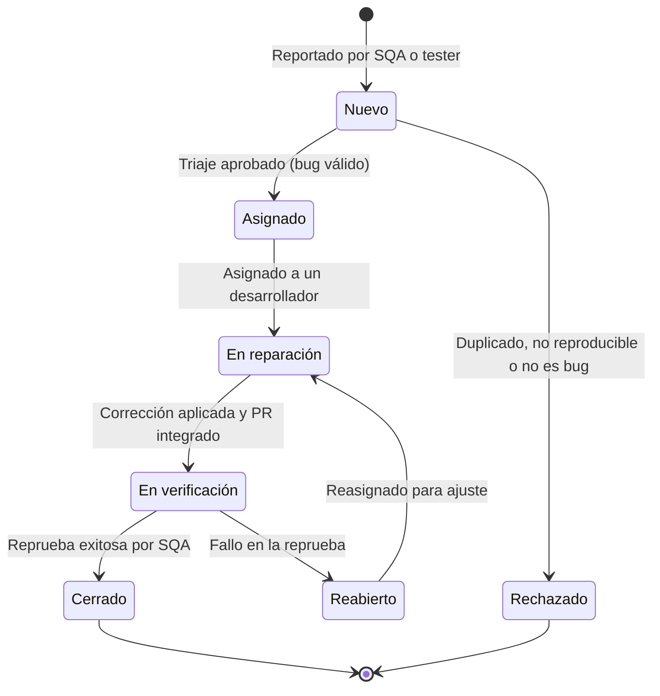

```mermaid
stateDiagram-v2
    state "Nuevo" as Nuevo
    state "Asignado" as Asignado
    state "En reparación" as EnReparacion
    state "En verificación" as EnVerificacion
    state "Reabierto" as Reabierto
    state "Rechazado" as Rechazado
    state "Cerrado" as Cerrado

    [*] --> Nuevo: Reportado por SQA o tester

    Nuevo --> Asignado: Triaje aprobado (bug válido)
    Nuevo --> Rechazado: Duplicado, no reproducible o no es bug

    Asignado --> EnReparacion: Asignado a un desarrollador
    EnReparacion --> EnVerificacion: Corrección aplicada y PR integrado

    EnVerificacion --> Cerrado: Reprueba exitosa por SQA
    EnVerificacion --> Reabierto: Fallo en la reprueba

    Reabierto --> EnReparacion: Reasignado para ajuste

    Rechazado --> [*]
    Cerrado --> [*]
```