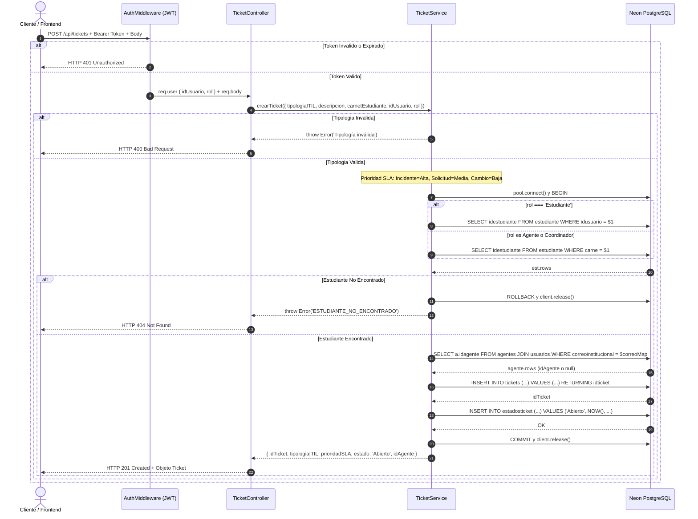

## 5.3 Diagrama de Secuencia del Endpoint Principal (`POST /api/tickets`)

El siguiente diagrama refleja la implementación real del servicio `crearTicket`, incluyendo la gestión transaccional con la base de datos Neon PostgreSQL, la resolución de roles y el mapeo automático de agentes según el correo institucional:

