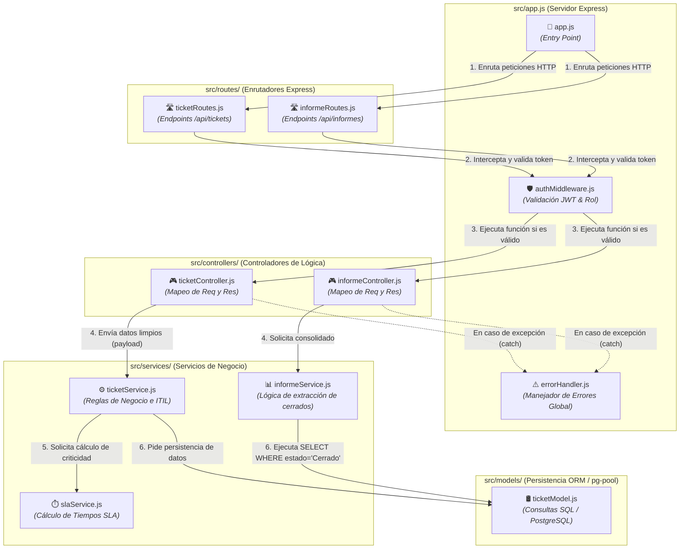

```mermaid
flowchart TD
    %% Directorios / Packages
    subgraph appPkg ["src/app.js (Servidor Express)"]
        app["📄 app.js<br/><i>(Entry Point)</i>"]
        authMid["🛡️ authMiddleware.js<br/><i>(Validación JWT & Rol)</i>"]
        errHand["⚠️ errorHandler.js<br/><i>(Manejador de Errores Global)</i>"]
    end

    subgraph routesPkg ["src/routes/ (Enrutadores Express)"]
        routeTicket["🛣️ ticketRoutes.js<br/><i>(Endpoints /api/tickets)</i>"]
        routeInforme["🛣️ informeRoutes.js<br/><i>(Endpoints /api/informes)</i>"]
    end

    subgraph ctrlPkg ["src/controllers/ (Controladores de Lógica)"]
        ctrlTicket["🎮 ticketController.js<br/><i>(Mapeo de Req y Res)</i>"]
        ctrlInforme["🎮 informeController.js<br/><i>(Mapeo de Req y Res)</i>"]
    end

    subgraph servPkg ["src/services/ (Servicios de Negocio)"]
        servTicket["⚙️ ticketService.js<br/><i>(Reglas de Negocio e ITIL)</i>"]
        servSLA["⏱️ slaService.js<br/><i>(Cálculo de Tiempos SLA)</i>"]
        servInforme["📊 informeService.js<br/><i>(Lógica de extracción de cerrados)</i>"]
    end

    subgraph modelPkg ["src/models/ (Persistencia ORM / pg-pool)"]
        modelTicket["🛢️ ticketModel.js<br/><i>(Consultas SQL / PostgreSQL)</i>"]
    end

    %% Relaciones de llamada e intermediación
    app -->|"1. Enruta peticiones HTTP"| routeTicket
    app -->|"1. Enruta peticiones HTTP"| routeInforme

    routeTicket -->|"2. Intercepta y valida token"| authMid
    routeInforme -->|"2. Intercepta y valida token"| authMid

    authMid -->|"3. Ejecuta función si es válido"| ctrlTicket
    authMid -->|"3. Ejecuta función si es válido"| ctrlInforme

    ctrlTicket -->|"4. Envía datos limpios (payload)"| servTicket
    ctrlInforme -->|"4. Solicita consolidado"| servInforme

    servTicket -->|"5. Solicita cálculo de criticidad"| servSLA
    servTicket -->|"6. Pide persistencia de datos"| modelTicket
    servInforme -->|"6. Ejecuta SELECT WHERE estado='Cerrado'"| modelTicket

    %% Flujos de excepción / Catch
    ctrlTicket -.->|"En caso de excepción (catch)"| errHand
    ctrlInforme -.->|"En caso de excepción (catch)"| errHand
```