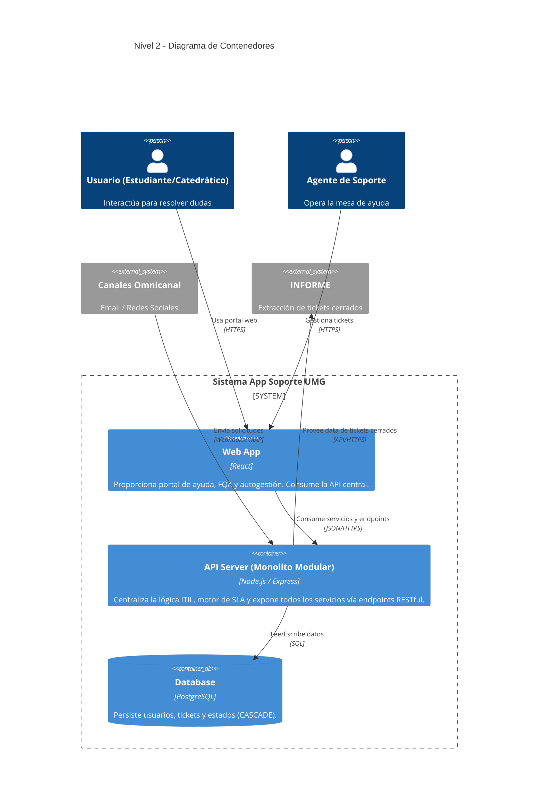

```mermaid
C4Container
    title Nivel 2 - Diagrama de Contenedores

    Person(usuario, "Usuario (Estudiante/Catedrático)", "Interactúa para resolver dudas")
    Person(agente, "Agente de Soporte", "Opera la mesa de ayuda")

    System_Boundary(appSoporte, "Sistema App Soporte UMG") {
        Container(webApp, "Web App", "React", "Proporciona portal de ayuda, FQA y autogestión. Consume la API central.")
        Container(apiServer, "API Server (Monolito Modular)", "Node.js / Express", "Centraliza la lógica ITIL, motor de SLA y expone todos los servicios vía endpoints RESTful.")
        ContainerDb(db, "Database", "PostgreSQL", "Persiste usuarios, tickets y estados (CASCADE).")
    }

    System_Ext(canales, "Canales Omnicanal", "Email / Redes Sociales")
    System_Ext(informe, "INFORME", "Extracción de tickets cerrados")

    Rel(usuario, webApp, "Usa portal web", "HTTPS")
    Rel(agente, webApp, "Gestiona tickets", "HTTPS")

    Rel(webApp, apiServer, "Consume servicios y endpoints", "JSON/HTTPS")
    Rel(canales, apiServer, "Envía solicitudes", "Webhooks/IMAP")
    Rel(apiServer, informe, "Provee data de tickets cerrados", "API/HTTPS")
    Rel(apiServer, db, "Lee/Escribe datos", "SQL")
```