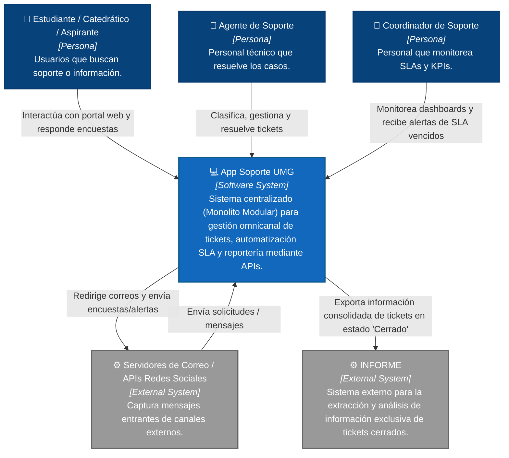

```mermaid
flowchart TD
    %% Estilos basados en C4 Model
    classDef person fill:#08427b,color:#fff,stroke:#073b6f,stroke-width:2px;
    classDef system fill:#1168bd,color:#fff,stroke:#0e5a8a,stroke-width:2px;
    classDef extSystem fill:#999999,color:#fff,stroke:#666666,stroke-width:2px;

    %% Actores / Personas
    usuario["👤 Estudiante / Catedrático / Aspirante<br/><i>[Persona]</i><br/>Usuarios que buscan soporte o información."]:::person
    agente["👤 Agente de Soporte<br/><i>[Persona]</i><br/>Personal técnico que resuelve los casos."]:::person
    coordinador["👤 Coordinador de Soporte<br/><i>[Persona]</i><br/>Personal que monitorea SLAs y KPIs."]:::person

    %% Sistema Principal
    appSoporte["💻 App Soporte UMG<br/><i>[Software System]</i><br/>Sistema centralizado (Monolito Modular) para gestión omnicanal de tickets, automatización SLA y reportería mediante APIs."]:::system

    %% Sistemas Externos
    canales["⚙️ Servidores de Correo / APIs Redes Sociales<br/><i>[External System]</i><br/>Captura mensajes entrantes de canales externos."]:::extSystem
    informe["⚙️ INFORME<br/><i>[External System]</i><br/>Sistema externo para la extracción y análisis de información exclusiva de tickets cerrados."]:::extSystem

    %% Relaciones
    usuario -->|"Interactúa con portal web y responde encuestas"| appSoporte
    agente -->|"Clasifica, gestiona y resuelve tickets"| appSoporte
    coordinador -->|"Monitorea dashboards y recibe alertas de SLA vencidos"| appSoporte

    appSoporte -->|"Redirige correos y envía encuestas/alertas"| canales
    canales -->|"Envía solicitudes / mensajes"| appSoporte
    appSoporte -->|"Exporta información consolidada de tickets en estado 'Cerrado'"| informe
```